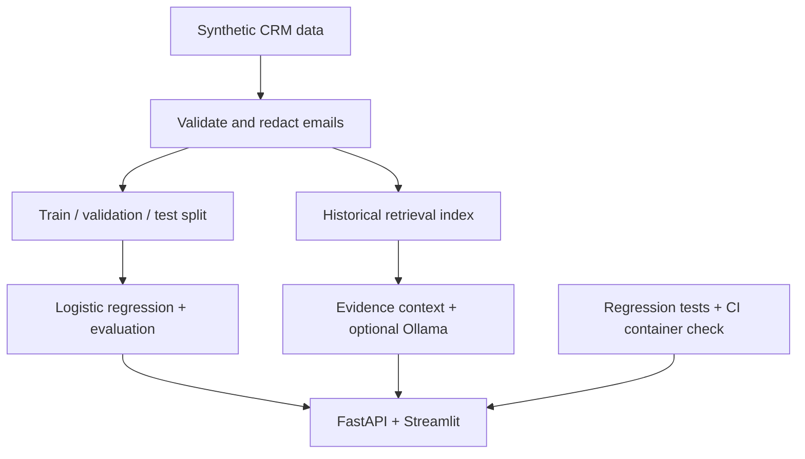
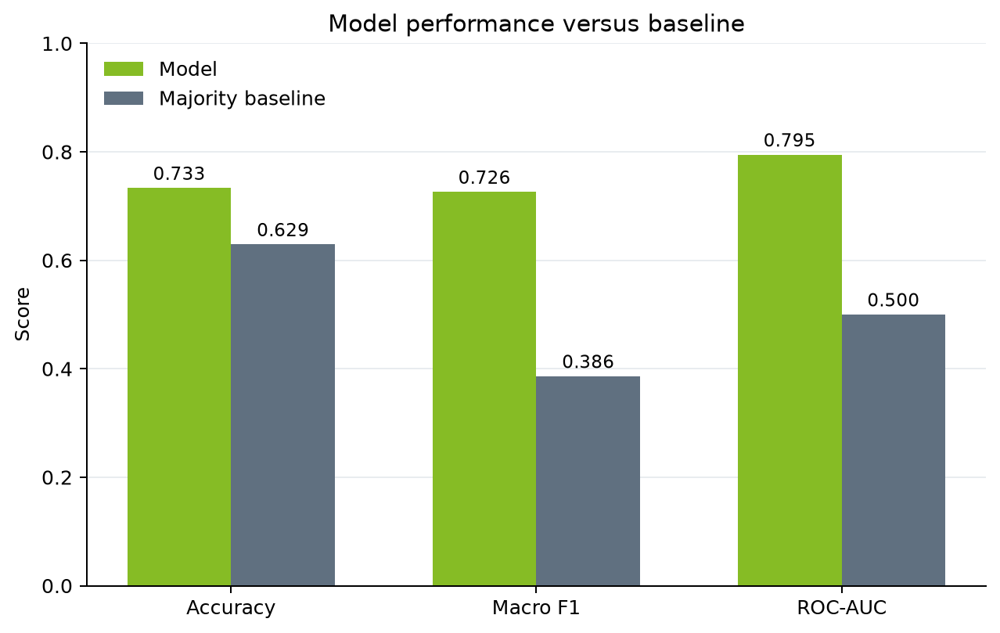
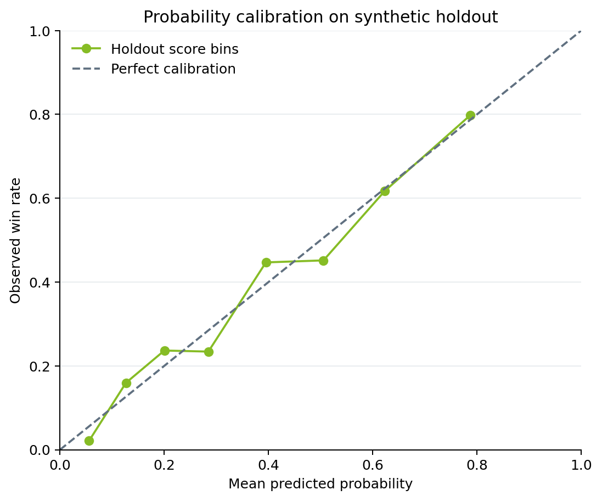

# AI Sales Pipeline Intelligence Platform

[](https://github.com/aliziyadmd-1115/ai-sales-pipeline-intelligence/actions/workflows/ci.yml)


A Data & AI engineering portfolio project that turns synthetic CRM opportunities into validated data, win-probability estimates, historical retrieval, and an optional evidence-based LLM workflow.

**All records are synthetic.** This project demonstrates engineering and evaluation; it does not claim real client data, production sales impact, or a live cloud deployment.

## Business problem

A sales analyst needs to prioritize opportunities, inspect comparable historical cases, and explain what supports a recommendation. This project joins data cleaning, predictive modeling, retrieval, and an API/UI in one reproducible workflow.

| Capability | Evidence |
|---|---|
| Data quality | Shared validation for ingestion/inference; per-field rejection counts; duplicate-conflict detection |
| Probability modeling | Text + structured logistic regression; 0.790 holdout ROC-AUC; Brier score 0.177 versus a 0.233 constant-probability baseline |
| Evaluation integrity | Separate training, validation, and test sets; exported split IDs and holdout predictions |
| Retrieval | TF-IDF with weak-match abstention; optional ChromaDB + sentence-transformer embeddings |
| LLM integration | Optional local Ollama; email redaction, citation-ID checks, malformed-output fallback |
| Application | FastAPI scoring/search/answer endpoints, liveness/readiness checks, Streamlit demo |
| Engineering | 65 regression tests; pinned direct dependencies; CI tests and running-container smoke check |

Open [the offline portfolio snapshot](docs/portfolio_preview.html) locally after cloning, or run Streamlit for an interactive demo. The snapshot is generated from actual artifacts and does not imply a live service.

## Architecture



Post-close fields (`outcome`, `actual_revenue`, `close_reason`) are excluded from prediction features. Retrieval ranks on pre-close notes, industry, and product; close reasons are returned only as historical evidence.

## Quick start: Windows / VS Code

Requires Python 3.13. From the repository folder in PowerShell:

```powershell
Set-ExecutionPolicy -Scope Process Bypass
.\setup_windows.ps1
.\run_demo.ps1
```

Setup creates a virtual environment, installs dependencies, generates the sample, evaluates the model, and runs tests. It stops on errors.

Start the API in a second terminal:

```powershell
.\.venv\Scripts\python.exe -m uvicorn src.api:app --reload
```

Open [interactive API documentation](http://127.0.0.1:8000/docs). Streamlit runs at [localhost:8501](http://localhost:8501).

## Quick start: macOS / Linux

```bash
python3 -m venv .venv
source .venv/bin/activate
python -m pip install -r requirements.txt
python -m src.prepare
python -m src.evaluate
python -m pytest -q
streamlit run streamlit_app.py
```

`make data`, `make evaluate`, `make test`, `make api`, and `make app` provide equivalent shortcuts once the environment is active.

## API contracts

| Endpoint | Purpose |
|---|---|
| `GET /health` | Process liveness; does not promise loaded resources |
| `GET /ready` | Load/validate model and retrieval resources; 503 if unavailable |
| `POST /predict-win` | Predict probability and apply the supplied threshold |
| `POST /similar-opportunities` | Return up to `top_k` sufficiently similar historical cases |
| `POST /answer` | Return historical evidence or optional LLM synthesis |

Example prediction request:

```json
{
  "notes": "Decision makers are engaged and requested a final analytics proposal.",
  "region": "Northeast",
  "industry": "technology",
  "customer_segment": "Mid-Market",
  "product_line": "analytics",
  "sales_stage": "proposal",
  "estimated_value": 75000,
  "days_in_pipeline": 52,
  "engagement_score": 78,
  "meetings_count": 5,
  "competitor_present": true,
  "discount_pct": 0.12,
  "proposal_sent": true,
  "decision_threshold": 0.50
}
```

Example `/answer` request:

```json
{
  "query": "analytics proposal with executive engagement and an active competitor",
  "top_k": 3,
  "use_llm": false
}
```

Inputs reject unknown fields, unsupported categories, blank/oversized text, invalid booleans, and non-finite or out-of-range numbers. Notes must contain 20–5,000 characters after normalization; queries 10–2,000. Search may return fewer than `top_k` matches. No evidence returns `status: "insufficient_evidence"` and never calls the LLM.

Read [the data dictionary](docs/data_dictionary.md) for accepted values.

## Reproducible evaluation

```bash
python -m src.prepare
python -m src.evaluate
```

The sample has **3,006 raw rows and 3,000 clean opportunities**. Six exact duplicates are removed. Fixed, stratified partitions contain 1,800 training, 450 validation, and 750 test rows. Sorting by opportunity ID makes the split stable to input-row shuffling.

| Test-set metric at default threshold 0.50 | Model | Baseline |
|---|---:|---:|
| ROC-AUC | **0.7902** | 0.5000 |
| Accuracy | 72.93% | 62.93% |
| Macro F1 | 0.6999 | 0.3863 |
| Brier score — lower is better | **0.1774** | 0.2333 |

The baseline predicts the training majority class and uses the training win rate as its constant probability. The ROC-AUC 95% row-bootstrap interval is **0.7570–0.8216**. It measures uncertainty for this fixed model on this synthetic holdout, not external generalization or training variability.

The model uses unweighted logistic regression. Class balancing was removed because it changes the training class prior and can distort raw probabilities. Calibration is assessed with Brier score and a reliability plot; perfect calibration is not claimed.





### Threshold selection

The following results come from the **validation set**, not the final test set:

| Threshold | Won precision | Won recall | Won F1 | Flagged |
|---:|---:|---:|---:|---:|
| 0.30 | 56.18% | 84.43% | 0.6746 | 55.78% |
| 0.40 | 61.00% | 73.05% | 0.6649 | 44.44% |
| 0.50 | 66.00% | 59.28% | 0.6246 | 33.33% |
| 0.60 | 71.56% | 46.71% | 0.5652 | 24.22% |
| 0.70 | 74.19% | 27.54% | 0.4017 | 13.78% |

Among these five candidates, 0.30 maximizes validation won-F1. Applying that frozen threshold to the test set yields 56.44% precision, 82.01% recall, and 0.6686 won-F1. The API default remains 0.50 and accepts an explicit threshold. These are technical tradeoffs; no business-optimal threshold is claimed without intervention costs, deal values, and capacity constraints.

### Auditable outputs

- `artifacts/data_quality.json`: cleaning counts and email-redaction scope.
- `artifacts/metrics.json`: test results, validation thresholds, dataset hash, package versions.
- `artifacts/split_manifest.csv`: opportunity IDs and their split.
- `artifacts/holdout_predictions.csv`: row-level predictions for independent calculation.
- `artifacts/threshold_analysis.csv`: validation-only threshold comparison.
- `artifacts/score_band_performance.csv`: test calibration bins.
- `docs/images/`: ROC, confusion matrix, baseline comparison, score bands, reliability plot.
- `docs/portfolio_preview.html`: generated offline snapshot.
- `artifacts/win_model.joblib`: locally generated model, excluded from Git.

### Retrieval evaluation limitation

The notes-only same-industry hit-at-3 proxy is **0.1833**, below the random expected **0.4873**, over 120 test queries against training-only history. This is a weak diagnostic: the synthetic notes repeat a small number of templates and contain no industry signal. A matching industry is not a human relevance judgment. This result does **not** establish retrieval quality.

Regression tests verify specific matching, abstention, privacy, and persistence behaviors. A realistic retrieval benchmark still requires richer histories and independently judged relevant cases. No semantic-quality or LLM-factuality score is claimed.

## Optional ChromaDB and Ollama

The default TF-IDF workflow requires neither an embedding-model download nor an LLM.

```powershell
.\.venv\Scripts\python.exe -m pip install -r requirements-vector.txt
$env:RETRIEVAL_BACKEND = "chroma"
.\.venv\Scripts\python.exe -m uvicorn src.api:app --reload
```

Chroma uses `all-MiniLM-L6-v2` and stores data in `artifacts/chroma_db/`. Its first use downloads the embedding model. Collection names include a content/embedding fingerprint, so changed data cannot silently reuse stale documents. Partial indexing is repaired with idempotent upserts. Old snapshots remain on disk until explicitly removed.

For an already running local Ollama service:

```powershell
$env:OLLAMA_BASE_URL = "http://localhost:11434"
$env:OLLAMA_MODEL = "llama3.2:3b"
```

Start/restart the API or UI from that terminal, then set `use_llm: true`. `.env.example` documents settings; `.env` is not automatically loaded by the application.

The LLM path redacts emails before sending the query/evidence, separates system instructions from untrusted text, bounds generated output, and falls back for service errors, malformed responses, missing citations, or invented citation IDs. Citation membership does **not** prove the associated claims are true or fully prevent prompt injection. Human review remains necessary.

## Verification and deployment

```bash
python -m pytest -q
# 65 passed
docker build -t ai-sales-pipeline-intelligence .
docker run --rm -p 8000:8000 ai-sales-pipeline-intelligence
# In a second terminal with the virtual environment active:
python scripts/smoke_api.py
```

The image uses an unprivileged account and `/ready` health checks. The Docker build context excludes Git metadata, local environments, credentials files, and cached models.

GitHub Actions regenerates data/evaluation and runs tests on Python 3.13, then builds and smoke-tests the running container. Local verification of this update covered Python 3.13, FastAPI over HTTP, and Streamlit's test harness. Docker, live Chroma embeddings, and live Ollama were not available for local end-to-end verification; mocked contract tests do not substitute for those runtime checks.

See [deployment details](docs/deployment.md), [model card](docs/model_card.md), and [interview talking points](docs/interview_talking_points.md).

## Repository map

- `src/`: generation, shared schemas, cleaning, modeling/evaluation, retrieval, LLM integration, API, preview generation.
- `tests/`: regression tests for the default workflow and optional-service contracts.
- `scripts/smoke_api.py`: running-service checks using the Python standard library.
- `data/`, `artifacts/`: synthetic inputs and reproducible evaluation evidence.
- `streamlit_app.py`: interactive scoring and evidence interface.
- `docs/`: architecture, model/data documentation, deployment, portfolio materials.
