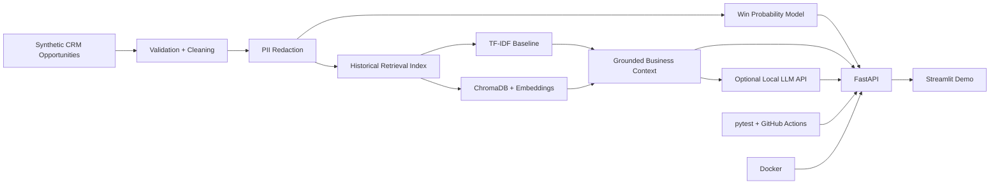
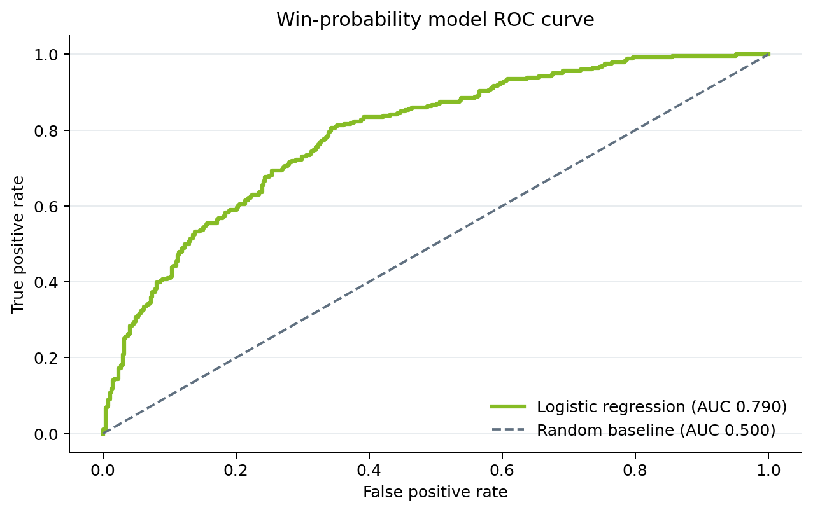
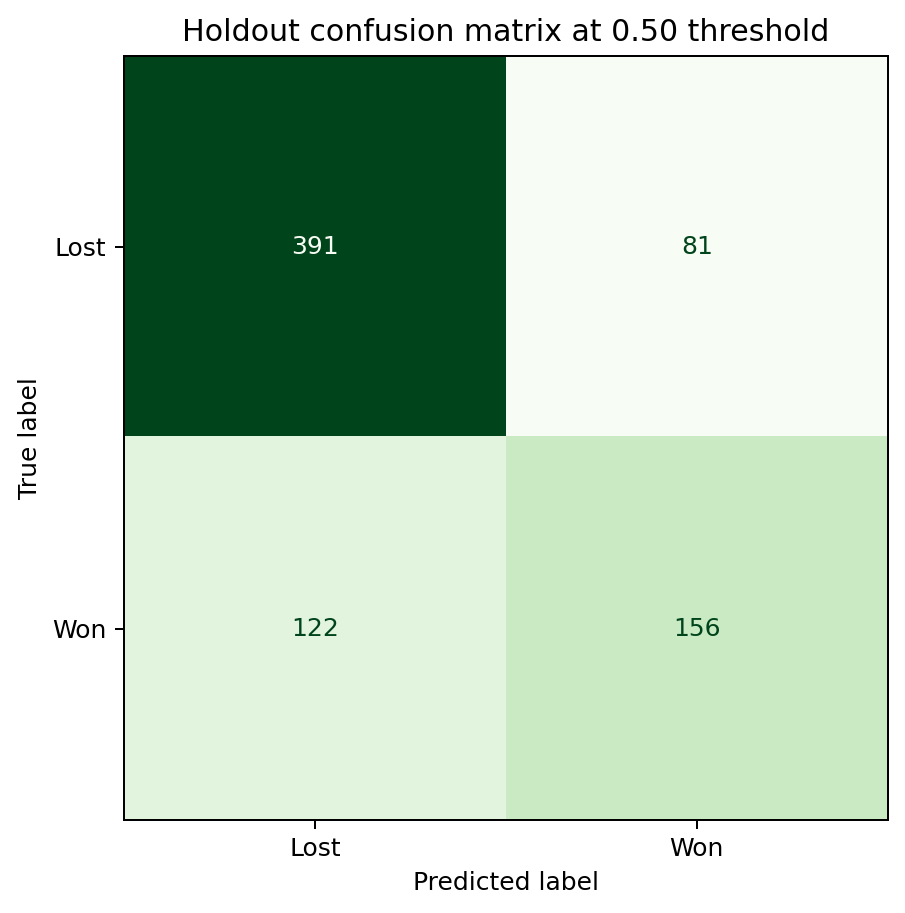
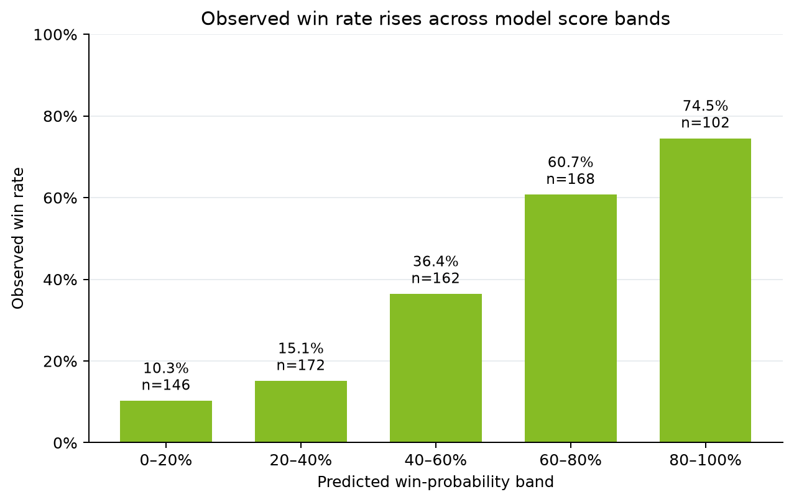

# AI Sales Pipeline Intelligence Platform

[](https://github.com/aliziyadmd-1115/ai-sales-pipeline-intelligence/actions/workflows/ci.yml)


An end-to-end **Data & AI engineering portfolio project** that converts synthetic CRM opportunity data into a governed analytics, machine-learning, retrieval, and API workflow.

The platform cleans and validates sales-pipeline data, redacts PII, predicts opportunity win probability, retrieves similar historical opportunities, and can generate grounded business analysis through a local LLM API. It also includes optional **ChromaDB vector search**, **FastAPI**, **Streamlit**, **pytest**, **GitHub Actions CI**, and **Docker**.

> **Portfolio note:** all CRM and opportunity records in this repository are synthetic. No employer, client, or confidential internship data is used.

## Why I built this

Traditional data-analysis projects often end with a notebook or dashboard. I wanted to demonstrate a fuller Data & AI solution lifecycle that starts with raw business data and ends with a tested, usable application:

**raw CRM data → data-quality checks → PII protection → ML scoring → historical retrieval → grounded AI analysis → API/UI → automated tests → containerization**

This project complements my SQL, Tableau, and Python analytics work by showing how analytical models can be operationalized as reusable services.

## Business use case

A sales or strategy team can use the platform to:

- score an active opportunity's probability of closing,
- find historical opportunities with similar business signals,
- inspect prior win/loss reasons,
- generate a grounded summary based only on retrieved historical evidence,
- expose the workflow to another application through REST endpoints.

### Recruiter quick view

| Proof | Current repository evidence |
|---|---|
| Reproducible ML benchmark | 0.795 ROC-AUC on a stratified 750-row holdout set |
| Business decision support | configurable classification threshold with precision/recall tradeoffs |
| Responsible AI | synthetic data, PII redaction, leakage controls, grounded citations, safe LLM fallback |
| Application delivery | three FastAPI endpoints plus a Streamlit business interface |
| Engineering quality | 15 automated tests, GitHub Actions CI, Docker build, generated evaluation artifacts |

For a presentation-ready walkthrough using the repository's reproducible sample output, open [`docs/portfolio_preview.html`](docs/portfolio_preview.html) after cloning the project.

## Architecture



## Core capabilities

| Area | Implementation |
|---|---|
| Data lifecycle | schema validation, deduplication, type handling, text normalization |
| Data governance | email PII redaction before modeling/retrieval |
| Machine learning | text + structured CRM features with Logistic Regression |
| Model evaluation | majority baseline, accuracy, macro F1, ROC-AUC, Brier score, score bands, threshold analysis |
| Retrieval | local TF-IDF similarity baseline |
| Vector database | optional persistent ChromaDB collection |
| Embeddings | sentence-transformers `all-MiniLM-L6-v2` |
| RAG-style workflow | retrieve historical opportunities, build grounded context, cite opportunity IDs |
| LLM integration | optional local Ollama HTTP API with retrieval-only fallback |
| API | FastAPI endpoints for scoring, retrieval, and grounded analysis |
| UI | Streamlit business demo |
| Engineering quality | 15 pytest tests, GitHub Actions CI, reproducible evaluation artifacts, Docker build |

## Repository structure

```text
.
├── .github/workflows/ci.yml
├── data/
├── artifacts/
│   ├── metrics.json
│   ├── score_band_performance.csv
│   └── threshold_analysis.csv
├── docs/
│   ├── architecture.md
│   ├── deployment.md
│   ├── images/
│   ├── interview_talking_points.md
│   ├── portfolio_preview.html
│   └── resume_bullets.md
├── src/
│   ├── api.py
│   ├── evaluate.py
│   ├── generate_data.py
│   ├── model.py
│   ├── pipeline.py
│   ├── rag.py
│   └── retrieval.py
├── tests/
├── .env.example
├── Dockerfile
├── Makefile
├── requirements.txt
├── requirements-vector.txt
├── render.yaml
└── streamlit_app.py
```

## Quick start - Windows / VS Code

### Fastest setup

```powershell
Set-ExecutionPolicy -Scope Process Bypass
.\setup_windows.ps1
```

Then launch the demo:

```powershell
.\run_demo.ps1
```

### Manual setup

```powershell
python -m venv .venv
.\.venv\Scripts\Activate.ps1
python -m pip install --upgrade pip
pip install -r requirements.txt
python -m src.generate_data --rows 3000
python -c "from pathlib import Path; from src.pipeline import run_pipeline; print(run_pipeline(Path('data/opportunities_raw.csv'), Path('data/opportunities_clean.csv')))"
python -m src.evaluate
pytest -q
```

Launch the API:

```powershell
uvicorn src.api:app --reload
```

Open `http://127.0.0.1:8000/docs` for interactive API documentation.

Launch the UI:

```powershell
streamlit run streamlit_app.py
```

## Advanced semantic vector-search mode

```powershell
pip install -r requirements-vector.txt
$env:RETRIEVAL_BACKEND="chroma"
uvicorn src.api:app --reload
```

The first semantic-search run creates a persistent ChromaDB collection in `artifacts/chroma_db/`.

## Optional local LLM API

The `/answer` endpoint supports an optional local Ollama model. Historical opportunities are retrieved first, and only that evidence is passed into the synthesis prompt.

```text
OLLAMA_BASE_URL=http://localhost:11434
OLLAMA_MODEL=llama3.2:3b
```

If the LLM is unavailable, the application falls back to retrieval-only evidence instead of inventing an answer.

## API examples

### Predict win probability

```json
POST /predict-win
{
  "notes": "Decision makers are engaged and requested a final analytics proposal.",
  "region": "Northeast",
  "industry": "technology",
  "customer_segment": "Mid-Market",
  "product_line": "analytics",
  "sales_stage": "proposal",
  "estimated_value": 75000,
  "days_in_pipeline": 52,
  "engagement_score": 78,
  "meetings_count": 5,
  "competitor_present": true,
  "discount_pct": 0.12,
  "proposal_sent": true,
  "decision_threshold": 0.50
}
```

### Retrieve similar opportunities

```json
POST /similar-opportunities
{
  "query": "analytics opportunity with executive engagement but an active competitor",
  "top_k": 3
}
```

### Generate grounded analysis

```json
POST /answer
{
  "query": "What do similar analytics opportunities suggest when executive engagement is strong but a competitor is present?",
  "top_k": 3,
  "use_llm": false
}
```

## Evaluation

Run `python -m src.evaluate`. The command trains the model, evaluates the fixed holdout set, regenerates the tracked metrics/CSV files, and writes the charts below to `docs/images/`.

### Current reproducible benchmark

Using the repository's 3,000-row clean synthetic dataset and a stratified 75/25 holdout split:

| Metric | Result |
|---|---:|
| ROC-AUC | **0.795** |
| Holdout accuracy | **73.3%** |
| Macro F1 | **72.6%** |
| Brier score | **0.187** |
| Majority-baseline accuracy | **62.9%** |
| Holdout rows | **750** |
| Automated tests | **15/15 passing** |


<details>
<summary>Additional evaluation visuals</summary>







</details>

### Decision-threshold tradeoff

The API defaults to a `0.50` threshold, but operational teams can adjust it based on capacity and the cost of missing a potential win. These are descriptive holdout results, not a claim that one threshold is universally optimal.

| Threshold | Won precision | Won recall | Won F1 | Opportunities flagged |
|---:|---:|---:|---:|---:|
| 0.30 | 49.8% | 91.4% | 64.5% | 68.0% |
| 0.40 | 54.9% | 85.3% | 66.8% | 57.6% |
| **0.50** | **61.1%** | **77.0%** | **68.2%** | **46.7%** |
| 0.60 | 65.9% | 64.0% | 65.0% | 36.0% |
| 0.70 | 70.3% | 46.0% | 55.7% | 24.3% |

For example, a sales team trying to avoid overlooking viable deals could review the `0.40` threshold, while a capacity-constrained team could review `0.60`. A real client implementation would select the threshold using validated intervention costs, expected deal value, team capacity, and out-of-time data.

The included numbers are **synthetic benchmark results, not production sales metrics**. A real deployment would also track business lift, human relevance judgments, latency, drift, and performance on time-based or external validation data.

## Test and CI coverage

The suite covers data validation and PII redaction, model training and threshold behavior, retrieval, FastAPI prediction/search/answer contracts, invalid requests, and LLM-service fallback. GitHub Actions reproduces the evaluation, runs all tests, builds the Docker image, and uploads the evaluation evidence for each commit.

```bash
pytest -q
# 15 passed
```

## Deployment readiness

Build and run the same API image locally:

```bash
docker build -t ai-sales-pipeline-intelligence .
docker run --rm -p 8000:8000 ai-sales-pipeline-intelligence
```

`render.yaml` provides a one-click container blueprint. The same Docker image can also run on AWS ECS/Fargate or Azure Container Apps. See [`docs/deployment.md`](docs/deployment.md) for production considerations. No live cloud endpoint is claimed until one is added here.

## Responsible AI and data-governance decisions

- Uses synthetic CRM data only.
- Redacts email addresses during preprocessing.
- Keeps outcome labels out of model input features.
- Grounds AI synthesis in retrieved historical records.
- Returns source opportunity IDs used as evidence.
- Falls back to retrieval-only results if the LLM service is unavailable.
